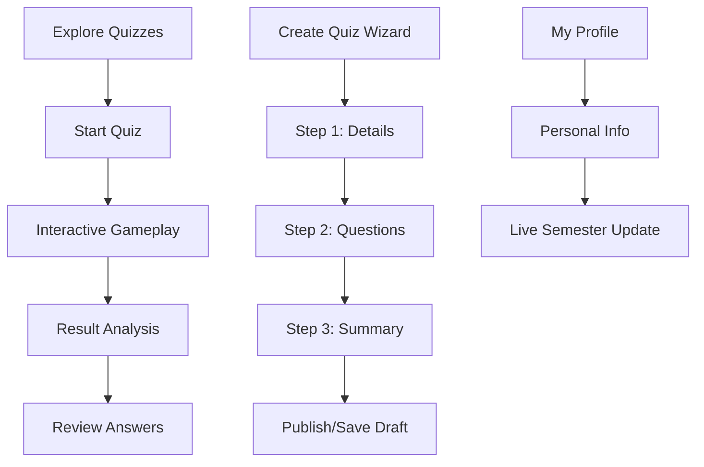

# PENSQuiz 🎓

PENSQuiz is a modern, high-fidelity quiz management and exploration platform built with **Laravel** and **MySQL**. It provides a seamless experience for students and educators to create, manage, and engage with educational quizzes in a visually stunning and highly interactive environment.

---

## 🚀 Key Features

### 1. **Quiz Wizard (3-Stage Workflow)**
Creating high-quality quizzes has never been easier. Our unified wizard guides you through:
- **Stage 1: Details**: Set title, major, course, duration, and access level.
- **Stage 2: Questions**: Add Multiple Choice or Checkbox questions with a dynamic, reactive interface.
- **Stage 3: Summary**: Review all details and questions before publishing. Includes smart validation to ensure quiz quality.

### 2. **My Quiz Dashboard**
- **Folder Organization**: Manage your quizzes in custom folders.
- **Live Filtering**: Search through your quizzes by title or tags with real-time feedback.
- **Statistics**: Track user engagement, starts, and completion rates for every quiz you create.

### 3. **Interactive Gameplay**
- **Smooth Navigation**: A polished quiz-taking experience with immediate feedback.
- **Result & Review**: Detailed analysis of performance after submission, allowing users to learn from their mistakes.

### 4. **Smart Profile Management**
- **Dual-Tab Interface**: Separate management for Personal Information and Login Credentials.
- **Academic Automation**: Automatically calculates your current semester based on your "Year of Entry" and the current academic calendar.

---

## 🛠️ Technology Stack

- **Backend**: Laravel 12
- **Database**: MySQL
- **Frontend**: Tailwind CSS & Alpine.js (for high interactivity)
- **Asset Bundling**: Vite

---

## 📦 Installation & Setup

### 1. Clone the Repository
```bash
git clone https://github.com/rizalmaulanaairlangga/SoftDev_PENSQuiz.git
cd SoftDev_PENSQuiz
```

### 2. Environment Configuration
Copy the example environment file and update your database credentials:
```bash
cp .env.example .env
php artisan key:generate
```
*Make sure to configure `DB_DATABASE`, `DB_USERNAME`, and `DB_PASSWORD` in your `.env` file.*

### 3. Install Dependencies
```bash
composer install
npm install
```

### 4. Database Migration
```bash
php artisan migrate --seed
```

---

## 🖥️ Running Locally

To start the application, you need to run both the Laravel development server and the Vite dev server for assets:

1. **Start Laravel Server:**
   ```bash
   php artisan serve
   ```

2. **Start Vite (Frontend Assets):**
   ```bash
   npm run dev
   ```

Once both are running, visit `http://127.0.0.1:8000` in your browser.

---

## 🔄 Core Application Flow



---

## 👤 Author
**Rizal Maulana Airlangga**
[GitHub Profile](https://github.com/rizalmaulanaairlangga)
